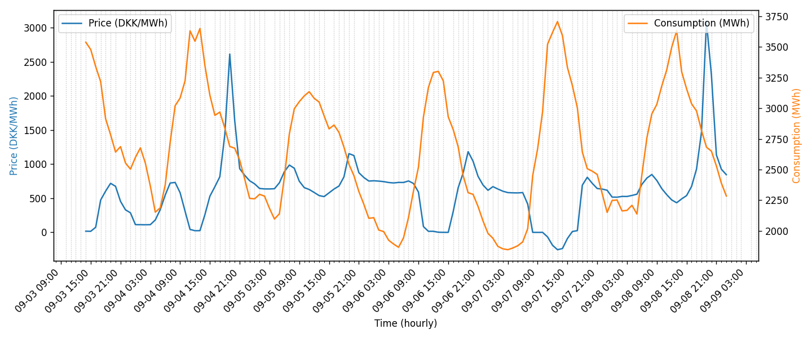

# Data BI Demo – Energi Data Service (DK Electricity)

This project is a **data engineering + BI demo** built to showcase skills in:
- Python (data pipelines, APIs, Pandas, Matplotlib)
- Working with **real open data** (Energinet / Energi Data Service)
- KPI design and reporting (growth, churn, ARPU, energy-specific KPIs)
- Reproducible analysis with CI/CD (tests + GitHub Actions)

---

## What the project does
- Pulls **day-ahead electricity prices** and **consumption** data from [Energi Data Service](https://www.energidataservice.dk/).
- Cleans, joins, and enriches the datasets.
- Computes **business-style KPIs**:
  - Average electricity price (DKK/MWh)
  - Peak consumption (MWh + timestamp)
  - Estimated total cost (price × consumption)
- Exports data and figures for BI/reporting.

---

## Example KPIs (latest run)
*(these values update when the pipeline is re-run)*

- **Avg price (7d, DK1):** `601.82 DKK/MWh`  
- **Peak consumption:** `3707.4 MWh @ 2025-09-07 13:00:00`  
- **Est. total cost (7d):** `197,956,062 DKK`

*(these values are as of 2025/09/18, I would replace with the data from most recent run)*

---

> **Note on prices:**  
> The electricity prices shown here come from [Energi Data Service – Elspotprices](https://www.energidataservice.dk/), which publishes **wholesale spot market prices** in **DKK/MWh**.  
> 
> - Example: `601.82 DKK/MWh` ≈ `0.60 DKK/kWh`.  
> - By contrast, Statistics Denmark (DST) reports **end-user retail prices** (≈ `2.8 DKK/kWh` = `2800 DKK/MWh`), which include transmission fees, grid tariffs, supplier margins, energy taxes, and VAT.  
> 
> This project is therefore visualizing **market fundamentals**, not the final consumer price you see on your energy bill.

---

## Example Output

**Joined dataset (price + consumption):**
- [`data/price_consumption_7d.csv`](data/price_consumption_7d.csv)  

**Hourly summary (avg price + consumption per hour-of-day):**
- [`report/hourly_summary.csv`](report/hourly_summary.csv)

**Visualization:**



---

## Tech Stack
- Python 3.11
- Pandas, Requests, Matplotlib
- GitHub Actions CI (pytest + ETL run)
- Data source: [Energi Data Service (Energinet)](https://www.energidataservice.dk/)

---

## How to run
Clone the repo and install dependencies:

```bash
git clone https://github.com/<your-username>/data-bi-demo.git
cd data-bi-demo
python -m venv .venv
source .venv/bin/activate   # Windows: .venv\Scripts\activate
pip install -r requirements.txt